# TAKWIRA

A mobile application written in flutter for booking football ,tennis and basketball fields with friends. It also contains an admin dashboard for handling the application


## Features

1- **Client side :**
- reservation of football pitches, basketball courts, tennis courts, ...
- search and find fields according to different criteria: location, availability, date, type, name,...
- view field information : price , location ,description , type, services,...
- TAKWIRA offers a notification system for its users and fields owners following a request for reservation or cancellation of the field.

2- **Owner side :**
- update all information concerning his field
- view the information of the bookings of his fields : field name, client name , date of booking , ...
- add new field (but it must be approved by the admin)

3- **Admin side :**
- consult all users and owners 
- add , delete , update a user or an owner
- accept or reject owner_request
- view , add , update , delete a field
- search and find fields or users according to different criteria: location, availability, date, type, name,...
- view statistics
## Environment Variables

To run this project, you will need to add the following environment variables to your .env file

1- **Server:**

`SERVER_PORT`

`DATABASE_DIALECT`

`DATABASE_USERNAME`

`DATABASE_PASSWORD`

`DATABASE_HOST`

`DATABASE_NAME`

`DATABASE_PORT`

`JWT_SECRET`

2- **Mobile:**

`addressIp`
## Tech Stack

**Client:** Flutter

**Server:** Expressjs

**Admin:** Reactjs, Redux

**Database:** MySQL
## Setup

Clone the every branch locally , in terminal run :

```bash
$ git clone https://github.com/MohamedBouarada/TAKWIRA
```

Install dependencies :

    1-Server and Dashboard:
      $ npm install
    2-Mobile:
      $ flutter pub get

Run the server :
```bash
  npm run dev
```
Run the app :    
```bash
  flutter run
```
Run Dahsboard admin :    
```bash
  npm start
```

## Screenshots


<table border>
<tr>
<th style="text-align:center">Home Screen</th>
<th style="text-align:center">Login Screen</th>
<th style="text-align:center">Signup Screen</th>
</tr>
<tr>
<td>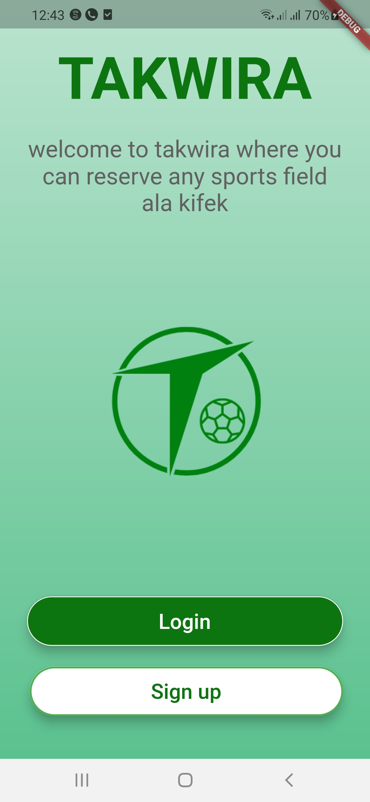</td>
<td>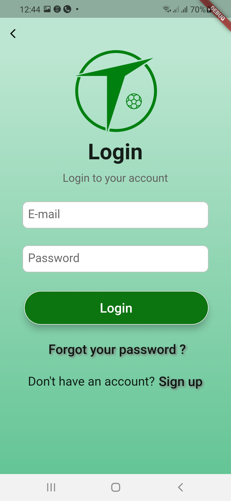</td>
<td>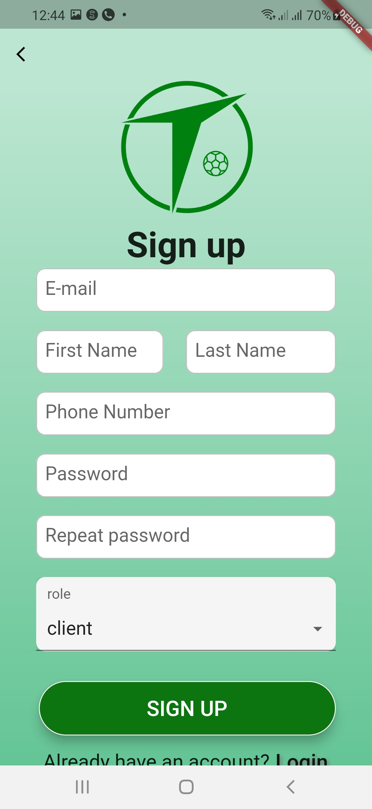</td>
<tr>
</table>

<table border>
<tr>
<th style="text-align:center">Welcome Screen</th>
<th style="text-align:center">Field Details Screen</th>
<th style="text-align:center">Field Details Screen</th>
</tr>
<tr>
<td>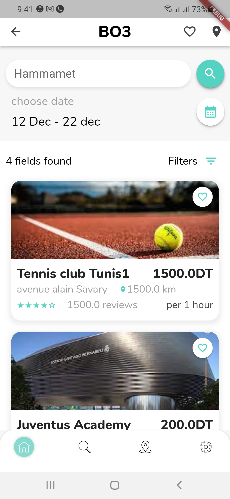</td>
<td>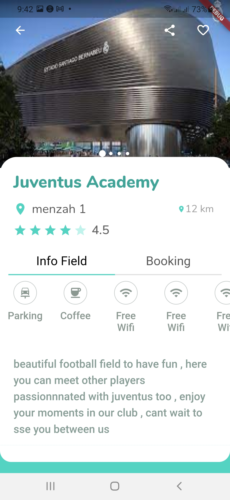</td>
<td>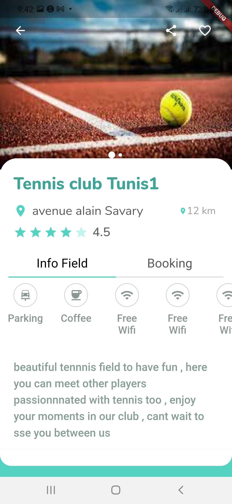</td>
<tr>
</table>

<table border>
<tr>
<th style="text-align:center">Field Booking Screen</th>
<th style="text-align:center">Settings Screen</th>
<th style="text-align:center">Logout</th>
</tr>
<tr>
<td>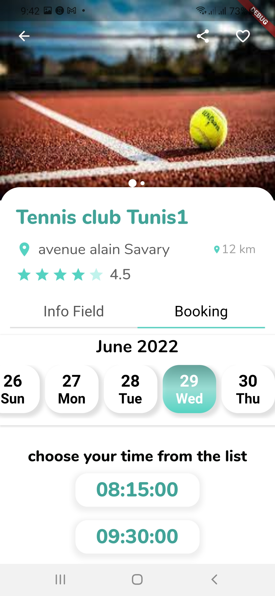</td>
<td>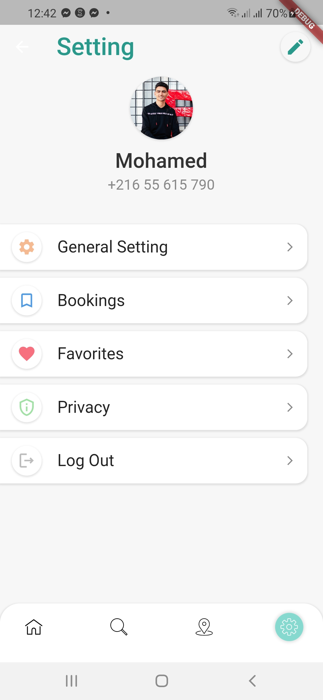</td>
<td>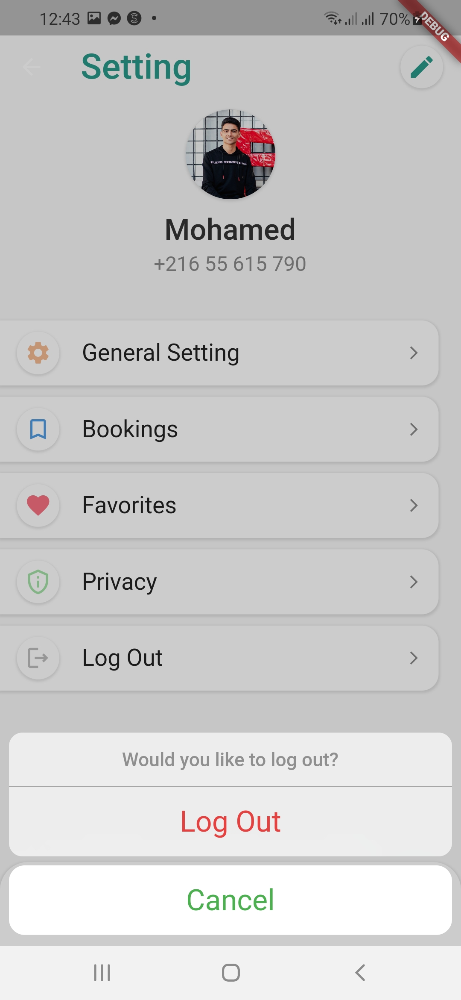</td>
<tr>
</table>

<table border>
<tr>
<th style="text-align:center">Add Field Form (1)</th>
<th style="text-align:center">Add Field Form (2)</th>
</tr>
<tr>
<td>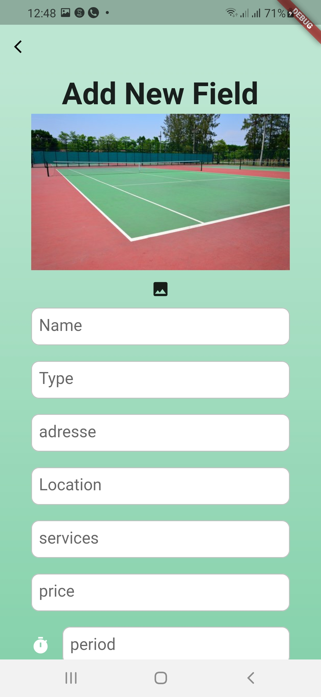</td>
<td>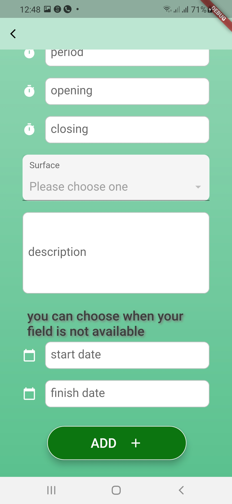</td>
<tr>
</table>

<table border>
  <tr>
    <th style="text-align:center">Dashboard</th>
    <th style="text-align:center">Users List</th>
  </tr>
  <tr>
    <td>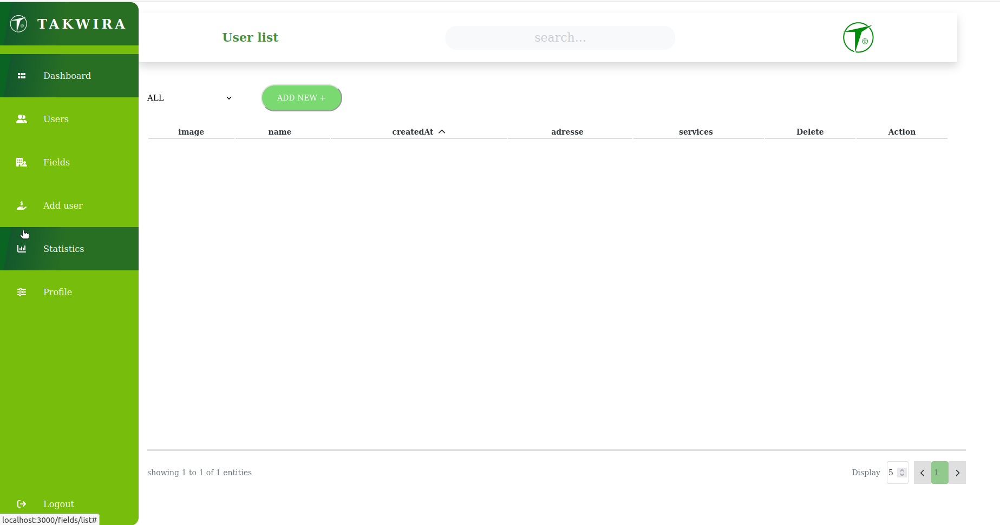</td>
    <td>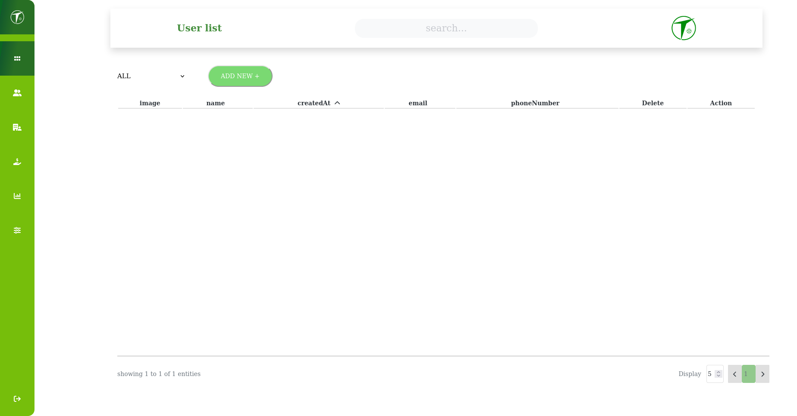</td>
  <tr>
</table>
<table border>
  <tr>
    <th style="text-align:center">Add new user</th>
  </tr>
  <tr>
    <td>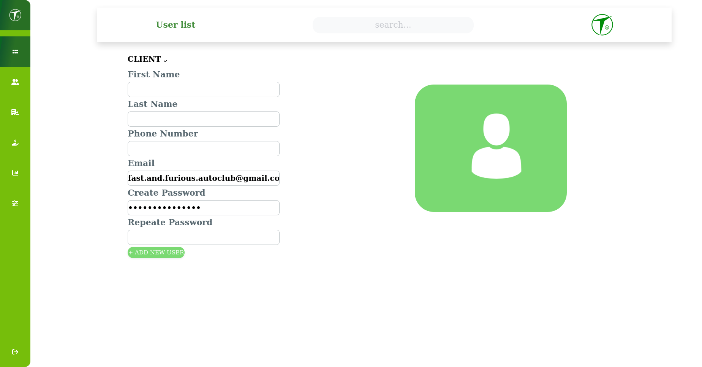</td>
  <tr>
</table>

